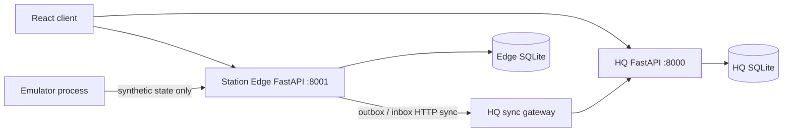

# PRATIBIMB V2 prototype

Human-coordinated remote operations and scenario review for PS 26060. This is a local software prototype; it is not connected to Antarctic equipment and is not a calibrated station digital twin.

## Local multi-process demo

Requirements: Python 3.11+, Node.js/npm, and dependencies from `requirements.txt` and `package-lock.json`.

```powershell
python -m venv .venv
.\.venv\Scripts\Activate.ps1
pip install -r requirements.txt
npm install
npm run demo
```

The launcher starts:

| Process | Default address | State |
|---|---|---|
| HQ FastAPI | http://127.0.0.1:8000 | `data/demo-runtime/hq.sqlite` |
| Station Edge FastAPI | http://127.0.0.1:8001 | `data/demo-runtime/station-edge.sqlite` |
| Independent station emulator | process, sends to edge API | Deterministic `DEMO_SYNTHETIC` sequence |
| React/Vite client | http://127.0.0.1:5173 | Browser UI |

The launcher generates local, process-scoped demo credentials for the edge and sync gateway. Demo sign-ins use password `123`: `admin_hq`, `admin_station`, or `admin_tech`. Do not expose these demo services to a public network.

To stop all processes, press Ctrl+C in the launcher terminal. `npm run dev` and `uvicorn backend.main:app --reload --port 8000` remain available for the legacy single-backend development mode; the independent station page requires the edge service to be started as well.

## Architecture and transport boundary



HQ and Edge have different SQLite files. The edge API reads and writes only its own database for station-local state, received operation envelopes, manual observations, and the durable event outbox. It does not open the HQ database. HQ retains its own operation/scenario/reconciliation journal and only receives station events through `/api/gateway/ingest`; edge operation delivery uses `/api/gateway/outbox` and `/api/gateway/ack`.

The demo transport control is an application-level HTTP gateway gate, not a network firewall. **STOP LINK** makes HQ gateway routes return HTTP 503. The Station Edge service and its local UI remain available, and local observations/actions persist in the edge database. Restore the link in HQ Command Center, then select **FORCE SYNC THROUGH HQ GATEWAY** in the Station Workspace's **OPEN INDEPENDENT EDGE** view. Sync is idempotent through event and idempotency keys; the existing server batch path checks payload hashes, order, operation state, and revision conflicts.

The existing default Station Workspace still contains its compatibility flow using HQ APIs and browser-local storage. Use **OPEN INDEPENDENT EDGE** for the separate-store architecture demonstration. The compatibility flow has not been migrated wholesale to edge storage yet; this is a known integration boundary, not a claim that every station screen is independent.

## Scenario model and provenance

Scenario model version `v0.2.0-causal-accounting` reports explicit prototype accounting for fuel, electrical power, and water. Thermal balance remains `UNKNOWN` unless thermal supply and demand are provided. No thermal output is inferred from an indoor/outdoor temperature. Uncertainty is labeled `NOT_MODELED`; no confidence interval is fabricated.

Projection comparison checks the scenario/result/operation model versions, station identity, observation timestamp against the scenario duration, expected unit, and observation quality. Missing or incompatible evidence is `NOT_COMPARABLE`. The comparisons and equations are software verification only, not evidence of physical station fidelity.

`backend.emulator.process_model` runs independently of the scenario forecaster and emits deterministic synthetic readings. Its seed and fault schedule can be changed with `PRATIBIMB_EMULATOR_SEED` and `PRATIBIMB_EMULATOR_FAULT_AT`. It does not import or call `run_scenario`. NCPOR public weather observations remain an independent environmental data source and are never labeled operational telemetry.

## Ports and local overrides

`python scripts/demo.py --hq-port 8000 --edge-port 8001 --web-port 5173 --station maitri` selects local ports and station profile. The independent edge database and HQ database paths are controlled by `PRATIBIMB_EDGE_DB_PATH` and `PRATIBIMB_DB_PATH`. The edge targets HQ with `PRATIBIMB_HQ_GATEWAY_URL`; the launcher creates per-run gateway tokens automatically.

## Known limitations

- This is a laptop demonstration, not a production or Antarctic deployment. Demo authentication, default fallback local tokens, CORS, network security, retention bounds, and operational availability are not production hardened.
- The independent edge workflow is available through its dedicated station view; the entire existing Station Workspace and Technical Workspace have not been migrated to edge-owned APIs.
- Emulator values are deterministic synthetic data and are not calibrated to current Maitri or Bharati station systems. Fault injection is a scheduled synthetic state transition, not an actual plant test.
- The causal model is prototype accounting, not validated station physics. Thermal inputs, uncertainty intervals, reserve policies, and calibrated resource thresholds are not supplied by approved station data.
- Resources/inventory planning, Measure Next, Robust Action Check, and general CSV/JSON event export remain unimplemented.
- Restart persistence is covered for the edge outbox; multi-process restart/recovery and full event-set equivalence still need broader integration validation.
- The Digital Twin scene remains a separate lazy-loaded chunk above Vite's 500 kB warning threshold (currently about 581 kB minified / 146 kB gzip); the main client bundle does not eagerly import it.
- No station hardware control, actuator endpoint, real operational sensor telemetry, or autonomous decision path exists.

## Validation commands

```powershell
python -m unittest discover -s backend/tests -q
python -m compileall -q backend data scripts
npm run build
npm run test:e2e
```
